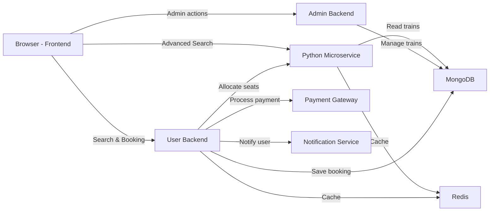

# Mugen-Train — Project Report

**Author:** Project repository
**Date:** 2025-12-15

---

**Abstract**

Mugen-Train is an AI-ready online train ticket booking system built using React (frontend), Node.js + Express (user backend), a separate admin Node.js service for train CRUD operations, MongoDB for persistence, and a Python FastAPI microservice (pyadmin) providing train-search and seat/PNR tools. This document is a 10-page technical report covering setup & start instructions, architecture, module-by-module logic, data models, important flows (search → book → payment → cancel), testing and deployment guidance.

<div style="page-break-after: always;"></div>

**Table of Contents**

1. Introduction & Goals
2. Technology Stack
3. Getting Started (Prereqs & Setup)
4. Running the Project (detailed commands)
5. System Architecture & Component Interaction
6. Backend (User) — APIs and logic
7. Admin Service (Train Management)
8. Python Service (Train search & seat logic)
9. Frontend — UI, state & flows
10. Data Models, Security, Testing & Troubleshooting

<div style="page-break-after: always;"></div>

## 1. Introduction

Mugen-Train is a modular, AI-ready train ticket booking platform that demonstrates a realistic, production-oriented end-to-end travel booking experience. The project integrates a React-based single-page application, separate Node.js services for user and administrative functions, MongoDB for persistent storage, and a Python FastAPI microservice for advanced train search and seat allocation. It was designed to be both a learning vehicle for full-stack engineering and a foundation for future AI-driven capabilities such as recommendation systems, intelligent seat assignment, and demand forecasting.

This report documents the project's goals, architecture, setup and start procedures, component responsibilities, key data models, and primary user flows (search → book → pay → cancel). It also highlights security considerations, testing strategies, and practical extension points to help developers deploy, extend, or adapt the system to real-world use cases.

## Objective

Primary Goal:
- Build a modular, secure, and extensible train-ticket booking platform that demonstrates reliable end-to-end workflows: user authentication, train discovery, seat allocation, booking, payment simulation, and cancellation.

Functional Objectives:
- Provide secure user registration and login with hashed passwords and JWT-based authentication.
- Implement robust train search by source/destination/date and present availability and fare per class.
- Support administrative CRUD for trains, routes, and class-level seat/fare configuration.
- Implement booking lifecycle: seat allocation, PNR/ticket number generation (Python microservice), booking persistence, confirmation and status updates.
- Expose clean REST APIs for frontend consumption and allow refresh/view/cancel operations for users.

Non-functional Objectives:
- Design components to be modular and maintainable (separate frontend, user backend, admin backend, Python microservice).
- Ensure baseline security: password hashing, token verification, input validation, and sensible CORS policy.
- Make the system deployable and scalable (MongoDB Atlas friendly, environment-driven configuration).
- Provide testability (unit and integration hooks) and developer-friendly startup scripts.

Measurable Success Criteria:
- User registration & login complete successfully with JWT (end-to-end test).
- Search returns correct trains for seeded routes and respects route ordering (source before destination) in ≥90% of cases with sample data.
- End-to-end booking flow (create booking → simulate payment → persist booking → view booking) completes without server errors.
- Cancellation marks bookings as `cancelled` and is reflected in user booking history.

Future / Extension Goals:
- Replace simulated seat assignment with deterministic seat-allocation algorithms or AI-assisted suggestions.
- Add payment gateway integration, audit logs, rate limiting and observability (metrics/logging).
- Add CI tests and an optional containerized deployment (Docker + Docker Compose).

Deliverables:
- Working code for frontend, user backend, admin backend, and `pyadmin` microservice.
- A 10-page technical report (this document) and optional certificate/PDF exports for stakeholders.


## 2. Technology Stack

- Frontend: React.js, Vite, TailwindCSS, React Router, Axios
- Backend (User): Node.js + Express, MongoDB, Mongoose, JWT
- Admin Backend: Node.js + Express, Mongoose (train store and management)
- Python microservice: FastAPI, PyMongo (connects to trains DB), used for rich train search logic
- Dev: nodemon, dotenv, Postman (or browser), Git

Files to inspect:
- Backend: [server/index.js](server/index.js) and routes/controllers at [server/routes/userRoutes.js](server/routes/userRoutes.js) and [server/controllers/userController.js](server/controllers/userController.js)
- Admin: [admin/index.js](admin/index.js), [admin/controllers/trainController.js](admin/controllers/trainController.js), [admin/models/train.js](admin/models/train.js)
- Frontend: [frontend/src/App.jsx](frontend/src/App.jsx), [frontend/src/components/Trains.jsx](frontend/src/components/Trains.jsx), [frontend/src/components/BookTicket.jsx](frontend/src/components/BookTicket.jsx)
- Python service: [pyadmin/main.py](pyadmin/main.py)

<div style="page-break-after: always;"></div>

## 3. Getting Started — Prerequisites

Before starting the project, install these:


Create the environment variables for each service. Example keys (place in each service `.env`):

- `server/.env`

## Software & Hardware Requirements

Software (development):
- Node.js v18+ and npm (for `server`, `admin`, `frontend`)
- Python 3.10+ and `pip` (for `pyadmin` service)
- MongoDB Atlas account or local MongoDB server (v5+ recommended)
- Git, a modern browser, and an editor (VS Code recommended)

Software (production suggestions):
- Container runtime (Docker) and optionally Kubernetes for orchestration
- Managed secrets and logging (e.g., AWS Secrets Manager, ELK)

Hardware (development machine - minimal):
- CPU: 2 cores
- RAM: 8 GB
- Disk: 20 GB free
- Network: stable broadband for package installs and DB connections

Hardware (production - small deployment):
- CPU: 4+ cores
- RAM: 8–16 GB per service node (scale horizontally as needed)
- Disk: 100 GB or more (for logs and DB backups)
- Network: low-latency connection to MongoDB Atlas or DB host

Notes:
- For local testing, a modest laptop (8 GB RAM) is sufficient, but running multiple services and databases concurrently benefits from 16 GB+ RAM. For production, use managed DB services (MongoDB Atlas) and scale service nodes behind a load balancer.

  - `PORT=5000`
  - `MONGO_URI=<your_mongo_connection_string>`
  - `JWT_SECRET=<your_jwt_secret>`
- `admin/.env`
  - `TRAIN_URL=<your_train_db_connection_string>`
  - `ADMIN_PORT=5001`
- `pyadmin/.env`
  - `TRAIN_URL=<same_train_db_connection_string>`
- `frontend/.env` (Vite envs)
  - `VITE_SERVER_API=http://localhost:5000`

> Note: Keep secrets out of source control.

<div style="page-break-after: always;"></div>

## 4. Running the Project — Step-by-step

1. Clone repository

```bash
git clone https://github.com/Akuma-002/Mugen-Train.git
cd Mugen-Train
```

2. Start the user backend

```bash
cd server
npm install
# create .env with MONGO_URI and JWT_SECRET
npm run dev    # uses nodemon, or `npm start` for production
```

3. Start the admin backend (train data)

```bash
cd ../admin
npm install
# ensure TRAIN_URL is set in .env
npm run dev
```

4. Start the Python train search service (optional but recommended)

```bash
cd ../pyadmin
python -m venv venv && venv\Scripts\activate  # Windows
pip install -r requirements.txt  # or install fastapi, uvicorn, pymongo, python-dotenv
uvicorn main:app --reload --port 8000
# FastAPI runs on http://localhost:8000 by default
```

5. Start the frontend

```bash
cd ../frontend
npm install
# set VITE_SERVER_API in .env if necessary
npm run dev
```

6. Use browser at `http://localhost:5173` (Vite) and backend at `http://localhost:5000`.

Note: The frontend expects the API at `VITE_SERVER_API` (see [frontend/src/components/Payment.jsx](frontend/src/components/Payment.jsx)).

<div style="page-break-after: always;"></div>

## 5. System Architecture & Component Interaction

High-level flow:

- User interacts with the React UI, submits search and booking requests.
- Frontend calls user backend (`/api/users/*`) to register/login and to create bookings.
- The admin train service holds authoritative train data and supports find/update endpoints. The Python FastAPI microservice offers an alternative search endpoint (`/api/trains/find`) using careful route ordering.
- Booking flow: Frontend sets up a booking object (`BookingInfo` context), goes to payment simulated page, then calls `POST /users/booking` to persist the booking inside the user's document (see [server/controllers/userController.js ticketBooking]).

Important design choices:
- Bookings are stored as subdocuments in the `User` document (array `bookings`) to quickly fetch a user's bookings.
- Trains are separate documents stored in a `Train` collection within the admin service (`admin/models/train.js`).
- Authentication uses JWT tokens, validated by `server/middleware/auth.js`.

## Proposed System

## Proposed System

Compact summary:
- A modular setup composed of a React SPA, Node.js user/admin backends, MongoDB, and a Python FastAPI microservice for seat allocation and advanced search. Services communicate over REST and are container-friendly.

Key points:
- Core stack: React (frontend), Node.js/Express (user + admin), FastAPI (seat/PNR), MongoDB (data).
- Simple booking flow: search → select & request booking → backend allocates seats (Python) and persists booking.
- Deploy: Docker for local dev, container orchestration (Kubernetes) in production; use env vars for configuration.
- Security: HTTPS, JWT for auth, and role-based access for admin operations.

**Architecture Diagram**



You can also view the raw Mermaid file at `docs/diagrams/system-architecture.mmd`.

## System Modules

Overview: This section lists the project's primary modules and their responsibilities.

- Frontend (`frontend/`): React SPA that handles routes, user interactions and state. Key files: `frontend/src/App.jsx`, components in `frontend/src/components/` (e.g., `Trains.jsx`, `BookTicket.jsx`, `Payment.jsx`). Communicates with APIs via `axios` and uses contexts for global state.

- User Backend (`server/`): User authentication, profile management, bookings persistence and business logic. Important files: `server/index.js`, `server/routes/userRoutes.js`, `server/controllers/userController.js`, `server/models/user.js`.

- Admin Backend (`admin/`): Train catalog and CRUD operations, route searching for admin purposes. Important files: `admin/index.js`, `admin/controllers/trainController.js`, `admin/models/train.js`, `admin/routes/trainRoutes.js`.

- Python Microservice (`pyadmin/`): Advanced train search and seat/PNR logic; useful for deterministic seat allocation and complex algorithms. Important file: `pyadmin/main.py`.

- Shared Data (MongoDB): Trains and users stored in MongoDB; indexes should be added on high-traffic fields (e.g., `train_number`, `email`, `bookings.ticketNumber`).

- Auth & Security: JWT-based auth implemented in `server/middleware/auth.js`. Passwords hashed via Mongoose pre-save hook in `server/models/user.js`.

- Payment & Notifications (simulated/extendable): Payment flow is simulated in `frontend`/`server` and can be replaced with third-party gateways (Stripe/PayPal). Notifications (email/SMS) can be integrated via webhooks or notification services.

- Logging & Monitoring: Instrument server and microservice logs (structured JSON), add health endpoints, and integrate metrics/alerts for uptime and performance.


<div style="page-break-after: always;"></div>

## 6. Backend (User) — APIs and Logic

Core routes (see [server/routes/userRoutes.js](server/routes/userRoutes.js)):

- `POST /api/users/signup` — create user (hashed password via `userSchema.pre('save')` in [server/models/user.js](server/models/user.js)).
- `POST /api/users/login` — verify credentials, return a JWT token.
- `POST /api/users/booking` — append booking object to the user document (no external seat allocation call here; frontend constructs seat numbers).
- `POST /api/users/refreshData` — fetch the latest user data.
- `PUT /api/users/:userId/cancel/:ticketNumber` — cancel booking (authenticated; checks booking status and updates it).

Implementation details:
- Passwords are hashed with bcrypt; login compares using `bcrypt.compare`.
- JWT tokens use `process.env.JWT_SECRET` and are valid for 7 days by default. Middleware `server/middleware/auth.js` extracts and verifies tokens.
- Bookings are stored as array subdocuments with fields such as `ticketNumber`, `trainName`, `trainNumber`, `travelDate`, `seatNumbers`, `class` and `status`.

<div style="page-break-after: always;"></div>

## 7. Admin Service (Train Management)

Purpose: CRUD trains and provide search functionality (useful for populating train list and route data).

Key routes (controller implementations):
- `GET /api/trains` — fetch trains
- `POST /api/trains` — add new train
- `PUT /api/trains/:id` — update train
- `DELETE /api/trains/:id` — remove train
- `GET /api/trains/find?source=...&destination=...` — find trains where source appears before destination in the route (see [admin/controllers/trainController.js findTrains]).

Train schema highlights ([admin/models/train.js](admin/models/train.js)):
- `classes_available` is a nested object with per-class seat/fare info
- `train_route` uses a `Map` of `stationSchema` entries storing station times and distances

Search logic: find trains where both source and destination are present and the station index of source is less than that of destination.

<div style="page-break-after: always;"></div>

## 8. Python Service (Train search & seat logic)

The `pyadmin` service (FastAPI) provides alternative train search endpoints with more robust sorting and route distance logic. See [pyadmin/main.py](pyadmin/main.py).

Why Python? It can contain heavier logic for seat allocation, shuffling PNR generation rules and other algorithms; it can later be expanded into a separate microservice with its own DB or ML models.

Example routes:
- `GET /api/trains/all` — return all trains
- `POST /api/trains/find` — advanced search that sorts route stations by `distance_from_source` and ensures source is before destination; returns readable errors when no trains found

Deploy separately (e.g., on port 8000) and keep TRAIN_URL env in sync with admin DB.

<div style="page-break-after: always;"></div>

## 9. Frontend — UI, State & Flows

Core concepts:
- React contexts manage cross-app state: `TrainList`, `TrainOne`, `SearchInfo`, `BookingInfo`, and `UserInfo`. See [frontend/src/components/context](frontend/src/components/context).
- `Trains.jsx` shows a search box and a list of trains. Arrival times are computed from `departure_time` and `total_time` using inline JS (see arrival computations in [Trains.jsx](frontend/src/components/Trains.jsx)).
- `BookTicket.jsx` collects traveler info and prepares a `booking` object then navigates to `Payment.jsx`.
- `Payment.jsx` posts booking to the backend endpoint `POST ${API_URL}/users/booking` and on success refreshes user data with `POST ${API_URL}/users/refreshData`.

UX notes:
- Booking uses a generated ticket number (`generateTicketNumber()` in `BookTicket.jsx`).
- Seat allocation is currently simulated client-side (random generation like `C1`) and can be replaced with a seat allocation call to the Python service for deterministic allocation.

<div style="page-break-after: always;"></div>

## 10. Data Models, Security, Testing & Troubleshooting

Data models:
- `User` (fields in [server/models/user.js](server/models/user.js)) — includes personal fields and `bookings` array.
- `Train` (admin / [admin/models/train.js](admin/models/train.js)) — includes `classes_available` and `train_route` map.

Security:
- Use HTTPS in production.
- Keep `JWT_SECRET` private and strong.
- Use CORS wisely — the app shares APIs with localhost in development.
- Consider rate limiting and input validation for production.

Testing & Validation:
- Manual tests: register, login, search, book, pay (simulate), view/cancel booking.
- Add automated tests: unit tests for route handlers, integration tests for API calls (e.g., jest + supertest for Node servers) and end-to-end tests (Cypress) for UI flows.

Common issues & fixes:
- MongoDB connection errors: ensure `MONGO_URI` alias and IP whitelist (Atlas)
- Port conflicts: change `PORT`, `ADMIN_PORT` or use `--port` flags
- CORS issues: check server `cors()` settings and Vite dev origin

---

### Appendix: Quick Commands

Start user backend:

```bash
cd server
npm install
npm run dev
```

Start admin backend:

```bash
cd admin
npm install
npm run dev
```

Start pyadmin (FastAPI):

```bash
cd pyadmin
pip install fastapi uvicorn pymongo python-dotenv
uvicorn main:app --reload --port 8000
```

Start frontend:

```bash
cd frontend
npm install
npm run dev
```

---

If you'd like, I can:
- Convert this Markdown into a 10-page PDF and add to the `docs/` folder, or
- Expand any section with diagrams, sequence diagrams, or example requests/responses.

Would you like me to produce a PDF version next? 
